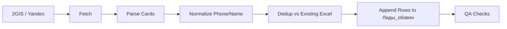

# 01. Общая Архитектура

## Цель системы
Система формирует и поддерживает актуальную таблицу контактов для обзвона: собирает данные о компаниях/специалистах, извлекает телефоны и переносит в стандартизированный Excel-шаблон.

## Логические слои
1. Source Layer: внешние источники (`2gis.ru`, `yandex.com/maps`).
2. Fetch Layer: загрузка страниц (через firecrawl или `requests`).
3. Parse Layer: извлечение карточек и телефонов из HTML/JSON-состояния страниц.
4. Normalize Layer: стандартизация названий и телефонов.
5. Dedup Layer: исключение дублей относительно текущей базы.
6. Output Layer: запись в `xlsx` по фиксированной схеме.

## Схема потока

## Ключевые правила архитектуры
- Источник истины по текущему состоянию базы: активный Excel-файл.
- Идентификатор уникальности: нормализованный телефон.
- Добавление инкрементальное: только новые строки.
- Повторяемость: одинаковый вход должен давать одинаковый результат после дедупликации.

## Нефункциональные требования
- Устойчивость к частичным сбоям источников.
- Таймауты на сетевые запросы.
- Проверяемость результата (число строк, уникальность, диапазон записей).
- Прозрачные временные артефакты (`/tmp/*.json`) для отладки.
