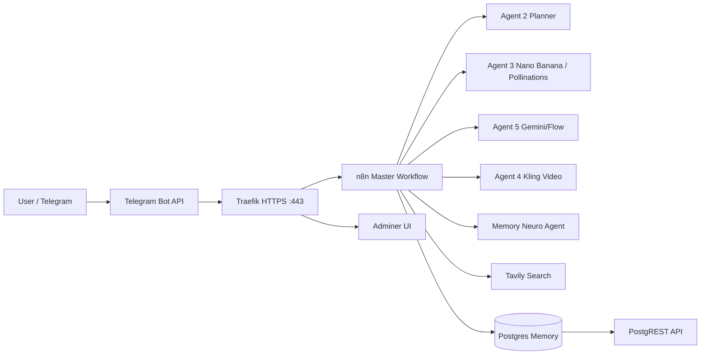
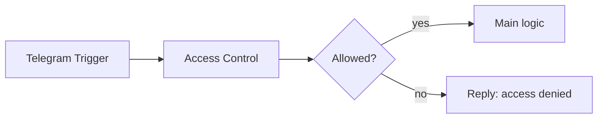

# 08. Архитектурные диаграммы

## 1) Инфраструктура (упрощённо)



## 2) Пайплайн master (актуальный)

```mermaid
flowchart TD
    S[Telegram Trigger] --> AC[Access Control]
    AC --> SW{Allowed?}
    SW -- no --> DENY[Telegram Reply: access denied]
    SW -- yes --> TXT[Set Text]
    TXT --> RP[Router | Intent Parse]
    RP --> MGR[AGENT 1 | Manager]
    MEM[Postgres Chat Memory] --> MGR
    MGR --> TOOLS[Agents 2/3/4/5 + Tavily + Memory Neuro]
    MGR --> G[Reply Guardrail]
    G --> OUT[Telegram Reply]
    MGR --> ERR[Set Error Reply]
    ERR --> OUT
```

## 3) Access control


