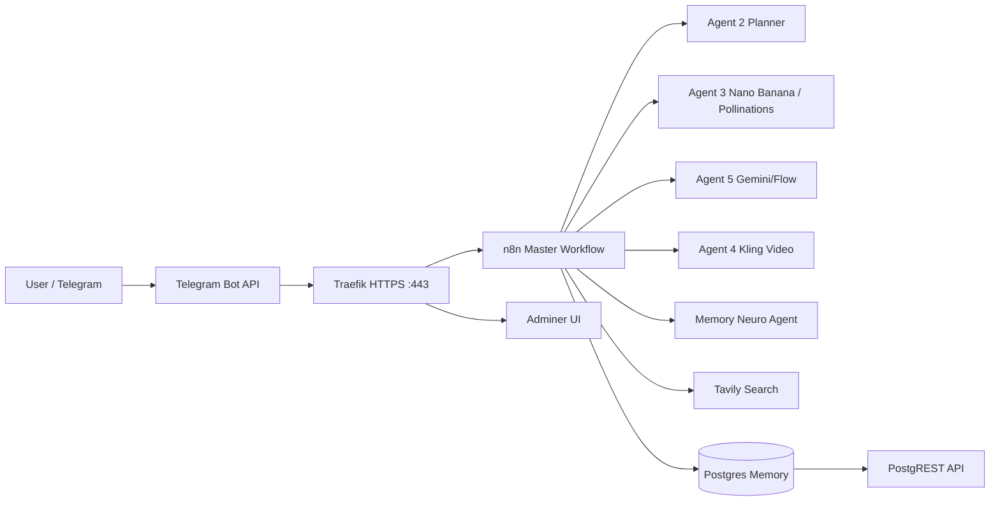
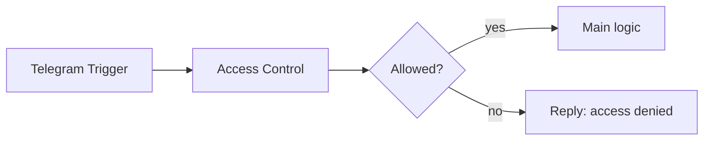

# 08. Архитектурные диаграммы

## 1) Инфраструктура (упрощённо)



## 2) Пайплайн master (актуальный)

```mermaid
flowchart TD
    S[Telegram Trigger] --> AC[Access Control]
    AC --> SW{Allowed?}
    SW -- no --> DENY[Telegram Reply: access denied]
    SW -- yes --> TXT[Set Text]
    TXT --> RP[Router | Intent Parse]
    RP --> MGR[AGENT 1 | Manager]
    MEM[Postgres Chat Memory] --> MGR
    MGR --> TOOLS[Agents 2/3/4/5 + Tavily + Memory Neuro]
    MGR --> G[Reply Guardrail]
    G --> OUT[Telegram Reply]
    MGR --> ERR[Set Error Reply]
    ERR --> OUT
```

## 3) Access control



## 4) Live call-center SVG

Для текущего боевого звонкового контура сохранена отдельная локальная схема:

- [callcenter_live_architecture.svg](/home/max/n8n_ai_call_center/docs/architecture/callcenter_live_architecture.svg)
- [callcenter_live_architecture_explained_ru.md](/home/max/n8n_ai_call_center/docs/architecture/callcenter_live_architecture_explained_ru.md)

Она отражает:
- `Mango -> Asterisk -> ElevenLabs -> n8n`
- live workflow `AUTODIAL_DISPATCHER_RECOVERY_2026-05-26_V2`, `VOICE_INBOUND_AGENT`, `ELEVEN_TOOL_CONTEXT_BRIDGE`, `ELEVEN_TOOL_CALL_LOG_BRIDGE`, `ELEVEN_TOOL_SEND_SMS_BRIDGE`
- текущие Postgres-слои (`n8n_prod`, `postgres_memory`, `call_center`)
- relay-host `151.241.228.232`
- ключевые live-paths и серверные директории.

Отдельный файл `callcenter_live_architecture_explained_ru.md` написан максимально простым русским языком и предназначен для быстрого входа в проект без глубокого технического контекста.
