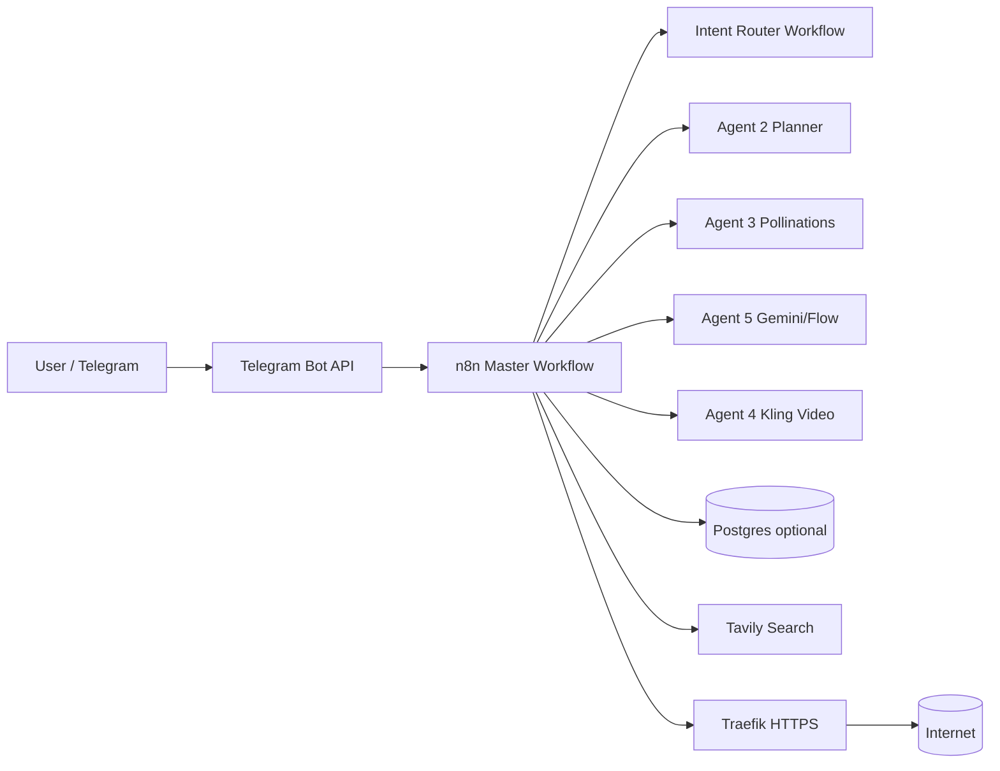
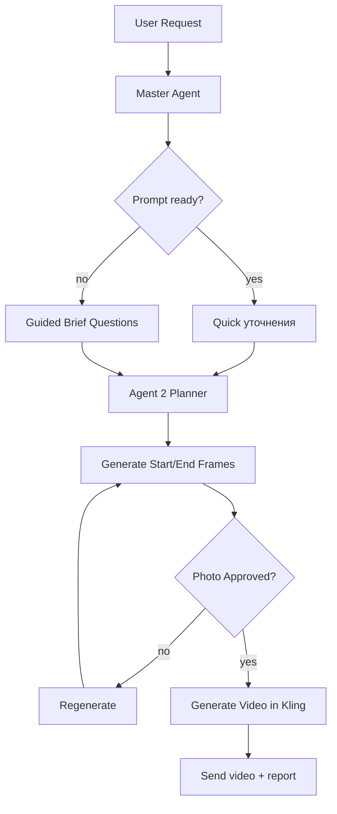
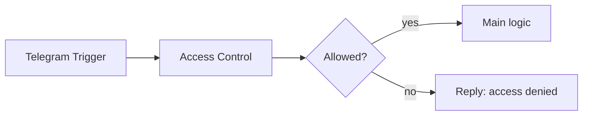

# 08. Архитектурные диаграммы

## 1) Инфраструктура (упрощённо)

```mermaid
flowchart LR
    U[User / Telegram] --> TG[Telegram Bot API]
    TG --> N8N[n8n Master Workflow]
    N8N --> R[Intent Router Workflow]
    N8N --> A2[Agent 2 Planner]
    N8N --> A3[Agent 3 Pollinations]
    N8N --> A5[Agent 5 Gemini/Flow]
    N8N --> A4[Agent 4 Kling Video]
    N8N --> DB[(Postgres optional)]
    N8N --> T[Tavily Search]
    N8N --> TR[Traefik HTTPS]
    TR --> NET[(Internet)]
```

## 2) Пайплайн контента (video-first)

```mermaid
flowchart TD
    S[User Request] --> M[Master Agent]
    M --> Q{Prompt ready?}
    Q -- yes --> U[Quick уточнения]
    Q -- no --> B[Guided Brief Questions]
    U --> P[Agent 2 Planner]
    B --> P
    P --> F[Generate Start/End Frames]
    F --> C{Photo Approved?}
    C -- no --> R[Regenerate]
    R --> F
    C -- yes --> V[Generate Video in Kling]
    V --> OUT[Send video + report]
```

## 3) Access control

```mermaid
flowchart LR
    TG[Telegram Trigger] --> AC[Access Control]
    AC --> SW{Allowed?}
    SW -- yes --> CORE[Main logic]
    SW -- no --> DENY[Reply: access denied]
```
